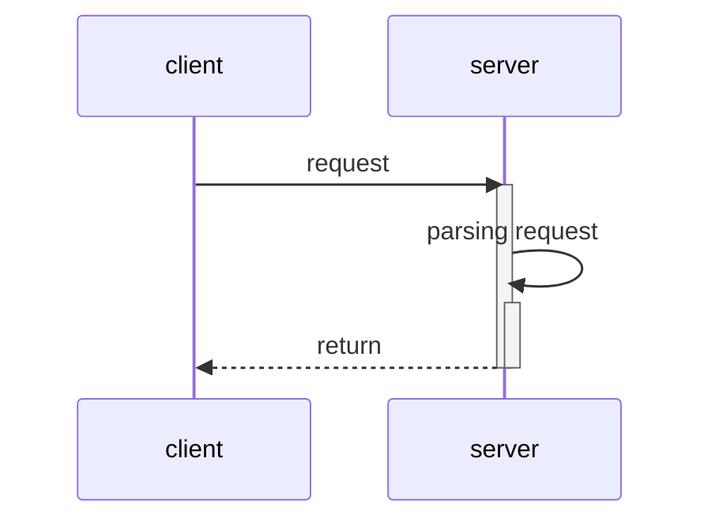

----
### To do list
9/12
- [ ] kqueue 정리
- [x] minimal 서버 구축하기

----
- kqueue의 udata의 존재를 잊지 마시오.
- select는 감시할 소켓의 fd를 유저모드로 들고 있음 -> OS에 구애 받지 않음
- kqueue / epoll 감시할 소켓의 fd가 커널이 들고 있음. -> OS별로 커널 자원에 접근하는 인터페이스가 다르기 떄문에 교차 사용이 불가능함.
- recv()가 각 send()마다 1대1로 매칭 되는 것이 아닐진데, 그러면 모든 recv를 sizeof로 처리를 하는 것만으로 충분할까?
	- size를 준 만큼 반복해서 수신을 하는가?
		- 이 경우에는 문제가 없을 것
	- 보낸 만큼만 읽으려고 할 것인가?
		- 이 경우에는 recv를 반복문을 통해 읽으려는 size와 읽은 데이터를 이어 붙이는 작업을 수동으로 해주어야 한다.
### 서버 / 클라이언트 시퀀스  다이어그램

- 메시지 예제
```
Client request:

GET /hello.txt HTTP/1.1
User-Agent: curl/7.64.1
Host: www.example.com
Accept-Language: en, mi

Server response:

HTTP/1.1 200 OK
Date: Mon, 27 Jul 2009 12:28:53 GMT
Server: Apache
Last-Modified: Wed, 22 Jul 2009 19:15:56 GMT
ETag: "34aa387-d-1568eb00"
Accept-Ranges: bytes
Content-Length: 51
Vary: Accept-Encoding
Content-Type: text/plain

Hello World! My content includes a trailing CRLF.
```
---

### 생각 (파생된 질문/생각)
- 어떤 요청을 받았느냐에 따라서 각 이벤트를 따로 설정해주어야 할텐데..
	- 한 소켓(클라이언트)에 연결된 버퍼에 read -> 해당 요청에 대한 response를 write
	- 기본적으로 소통을 하려면 답변을 해야하기 때문에 read와 write를 모두 설정해주면 될 것 같다.
	- error는 어떻게 해야할까?
	- 시그널은 어떻게 해야할까?
### 출 처
- 
### 연결 문서: {연결 이유}
- [[kqueue]]
- [[kevent]]
- 